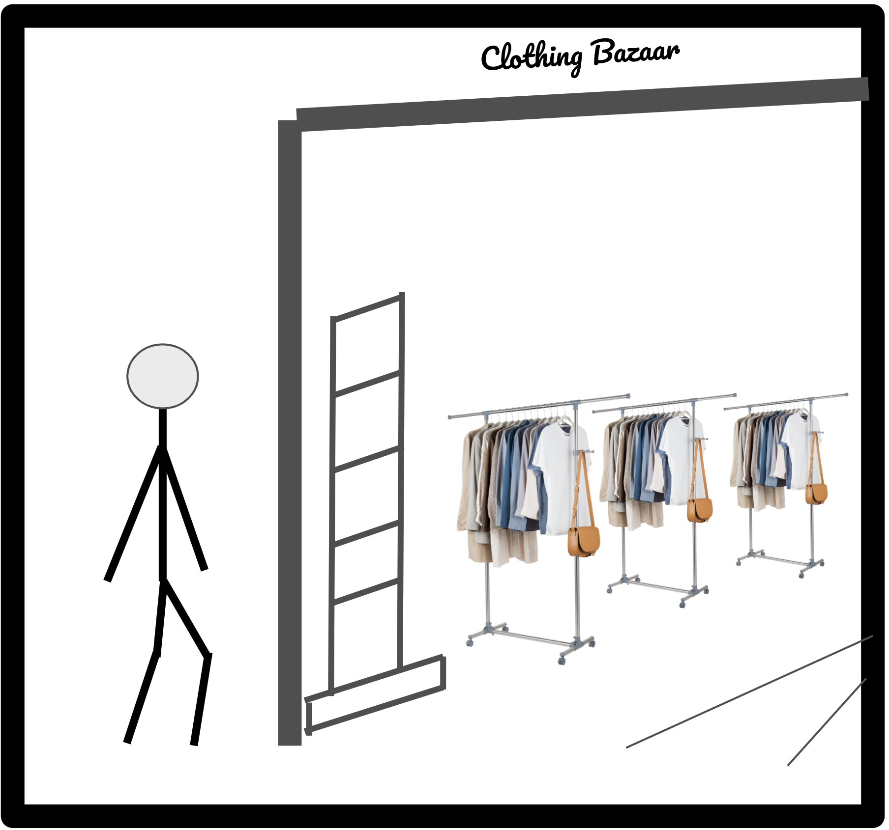
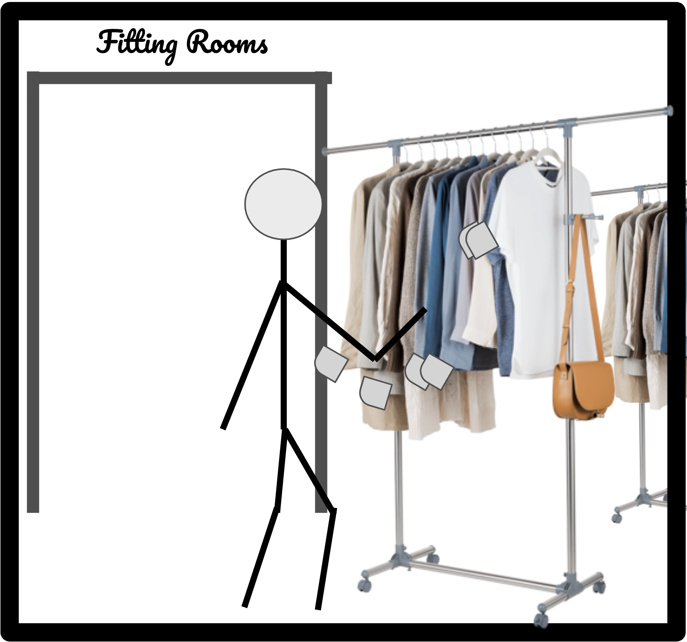
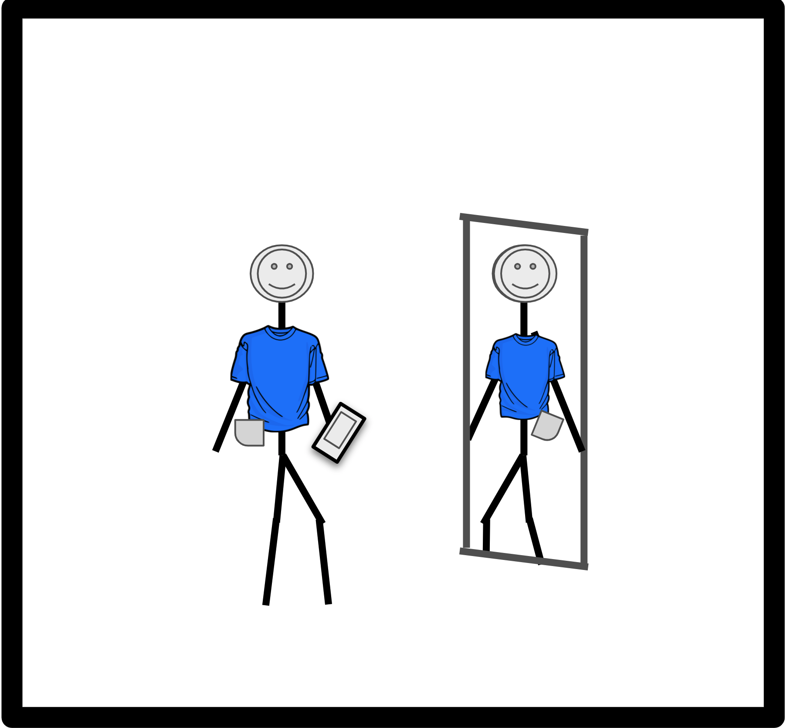
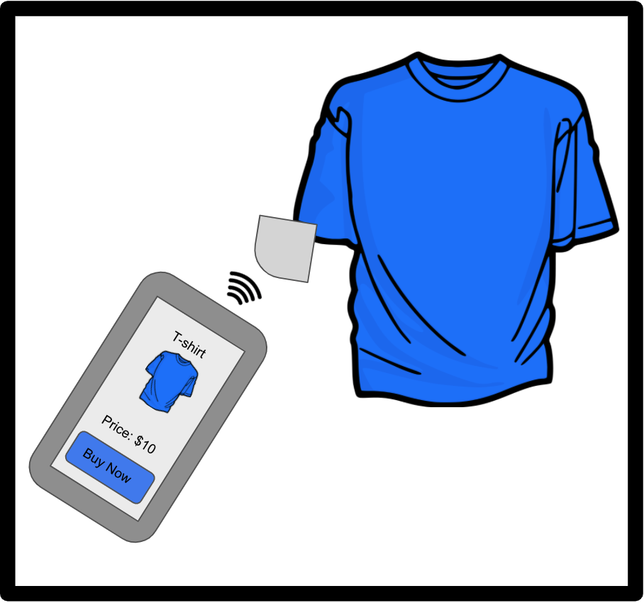
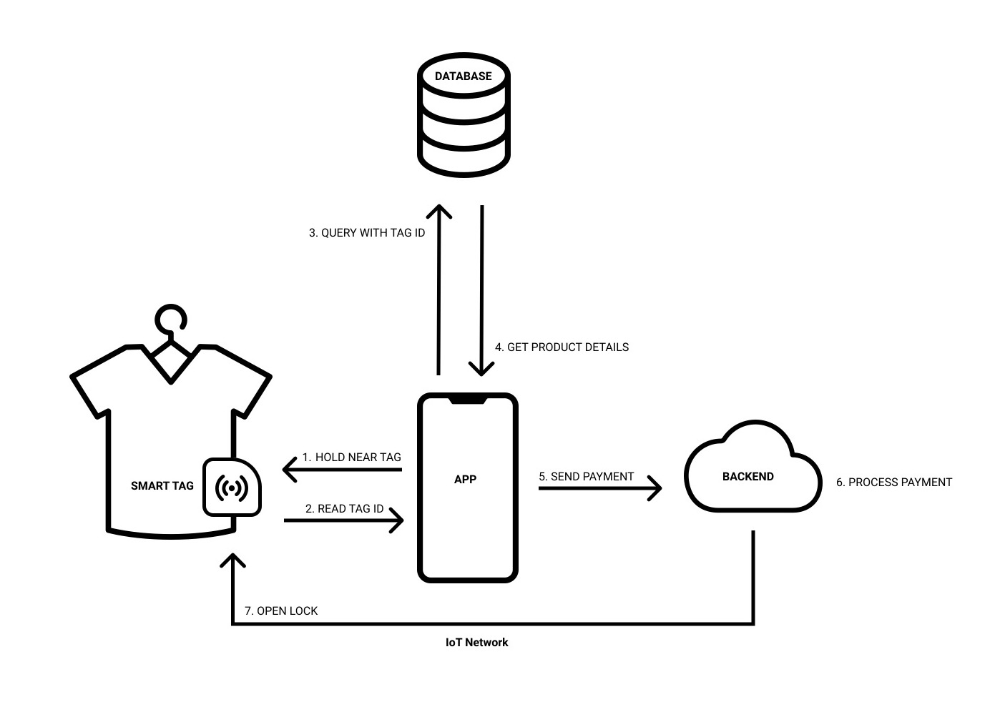
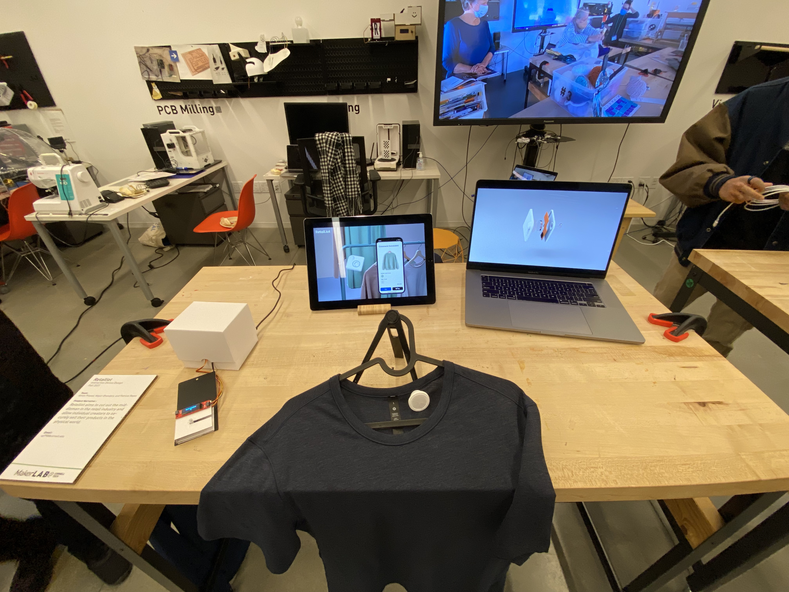
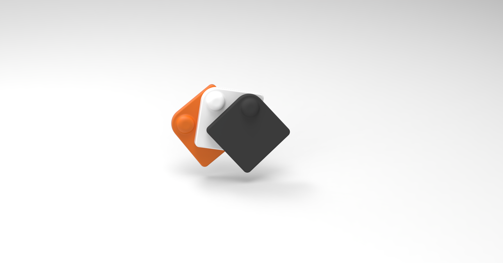
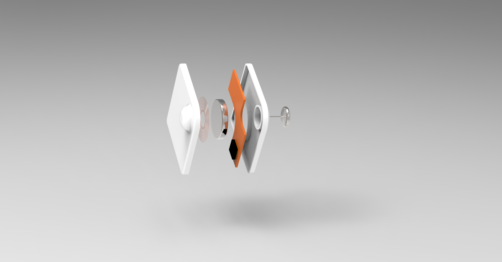
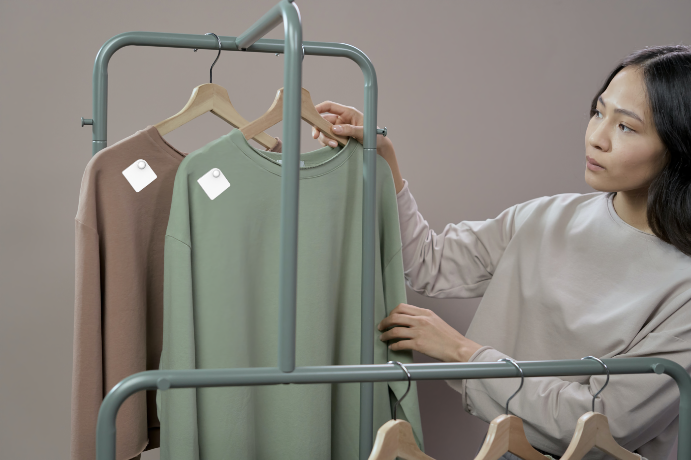

# Retailiot - The Smart Clothing Lock
Patricio Reyes, Mayur Bhandary, Aman Prasad
## Overview
The rise of e-commerce has been a growing threat to in-person shopping for over a decade, and the current pandemic has only exacerbated the situation for traditional offline retail stores. Despite the convenience of online shopping, customers are still frustrated with the experience of buying clothing online. Important properties of clothing such as size, texture, and quality cannot be communicated digitally. When users receive a product that doesn't fit them correctly or is not what they expected, the burden of returning the item is bestowed upon them. Furthermore, only a few e-commerce giants and retailers are capable of constructing a supply chain that can promise reasonable delivery times and free returns. For these reasons, we decided to build a checkout experience that augments the in-person shopping experience with a mobile checkout flow. Users can use our device to purchase clothing without speaking to a representative or waiting in line at a checkout counter.  

Retailiot is a smart clothing lock for mobile checkouts at shopping racks. The device uses a motorized locking mechanism to pierce the article of clothing with a needle in order to attach itself. Once the device is attached, it can only be unlocked when a customer purchases it. Customers can interact with the device directly by using a mobile app to scan the device via NFC and pay for it with their prefered payment method. The purpose of this device is to reduce checkout times at retail stores and make it easier for merchants to secure their products.   

## Storyboard

A customer enters the store in search of new clothing. 

The customer inspects the clothing as usual. Smartlocks have been placed on the items to prevent theft and enable mobile checkout.  

The customer tries on the clothing and decides they are happy with it. 

The customer purchases the clothing with their smart phone which automatically disengages the smart lock. 

## System Diagram

The system consists of the device, an app, a database, and a backend. Each smart lock has an NFC tag that stores the id for the device. When the user scans the device with the app, the app retrieves product information from the database for the id that was scanned. After the user completes the checkout flow with their preferred payment method, the app sends a GET request to the backend hosted on Heroku to unlock the device. The backend publishes a message to an MQTT topic that the device is subscribed to which signals the device to unlock itself.

## Prototyping

Our first iteration of the device was very crude. We used this to determine whether a servo motor and safety pin would be strong enough to secure the clothing. After experimenting on a sock, we determined that this mechanism should be sufficient for our prototype.  

We used cardboard to create a fully functional prototype of our device and collect feedback. The device is shaped like a tile with a slit across the corner to insert clothing. Since we used the servo motor to actuate the needle, we created another slit to allow the motor arm to move freely when locking and unlocking the device. 

Based on feedback from our functional checkout, we included a screen to display information about the article of clothing (Locked/Unlock status, Price, and type of clothing). We also mounted the device on a traditional clothing tag so that it blends into the shopping experience. 

## User Interaction

Please find the recording of our user interaction here: [Video Link](https://drive.google.com/file/d/1DC-38QKEgu_p1Xz8FAwewM-pzztCn6vj/view?usp=sharing)

This video shows a user interacting with our device by trying to remove it from the clothing (checking if it can be stolen) and then using the app to purchase the clothing and unlock the device. We noticed that it was not clear where the NFC tag was placed and there was a slight delay in getting the app to recognize the device. It would be useful to place an NFC wave logo on the tag to indicate where the user is supposed to tap their phone. The user also pointed out that the word "scan" on the app is misleading. The button should instead say something like "Tap The Smart Lock". It could also have a small animation showing the user how to interact with the device. 

## Code

#### Device:
- The device code can be found in the files smart_lock.py and text_draw.py. The smart_lock.py script simply subscribes to an MQTT topic corresponding to its device id ('123' was used for our prototype device) and moves the servo arm when it receives the lock and unlock messgages. '1' was used to lock the device and '0' was used to unlock it. The text_draw.py script was used to display text on the device screen. 

#### Backend:
- The backend utilzes FastAPI to create an API wrapper for the MQTT publishing functions. The software is deployed to Heroku such that it can be accessed via the mobile application. When the mobile application sends a request to the API to toggle the lock for a particular device, the server issues an MQTT message to that device. We plan to expand this backend to incorporate a database system that links devices to products, and also completes payments. The goal is to trigger an unlock once a payment is successfully completed, and to trigger a lock once the merchant decides to secure the lock.

#### App:
- The app (written in Swift), scans an NFC tag that lives on the lock, and uses that to pull up information about the product that the lock is secured to. The user is then able to use the app to "pay" for the product, subsequently releasing the product from the lock. In the future, we aim to request the product information from the backend (which will pull product information from the database). We also aim to incorporate the payment system, along with a "cart" mechanic which would allow shoppers to purchase multiple products at once.

## Open Studio 

We participated in open studio to demonstrate our project and get feedback from attendees. Overall, the device was well received and the participants felt that they could see themselves using it to checkout at retail stores. 

One question that we repeatedly received was what does the user do with the device after it has been unlocked? Our suggestion was to have baskets to drop the unlocked devices into. The attendees seemed satisfied with this answer, but we acknowledge that this makes the experience a bit clunkier. An alternative that we thought through was to eliminate the device for cheaper items and introduce the NFC sticker to the existing tags on the clothing. This would allow on the spot checkout without the device, but it would not have the added security of a clothing lock. One attendee suggested that we target high end retailers who frequently use heavy duty clothing locks with their premium products. 

Other feedback included interaction nuances, technical challenges, and ethical considerations:
- If a customer purcheses many items at once, it might become annoying to self-checkout each one. 
  - This device might be better suited for stores where only a few items are purchased at a time.
- Some clothing manufacturers take packaging very seriously. The aesthetics of the lock will be very important in gaining adoption.
  - There might be opportunities to work closely with manufacturers to create custom tags for their specific clothing items.  
- NFC requires close proximity with the tag. QR codes don't have this constraint and they are more widely adopted.
  - This is a fair criticism, and we would like to create a version of this product that uses QR code in the future. NFC has the benefit being able to work offline so we still think there is room for it in our device. 
- This product might eliminate cashier jobs. 
  - Retail is already being threatened by e-commerce. We believe this device could help bring customers back to traditional retail and actually increase the number of retail jobs. This device serves a customer segment that wants to quickly grab an item and leave, but the need for customer service and cash registers will still exist. 
 

We generated high fidelity concept prototypes of our envisioned device. Our design draws inpiration from popular tag-like devices such as Tile and AirTags.   

