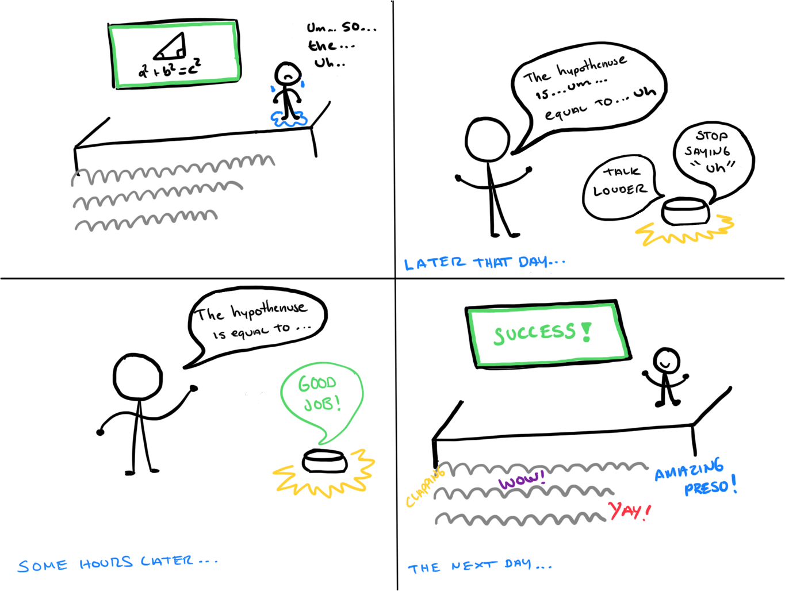

## Part 1.
### Text to Speech 

Now, you might wonder what exactly is a `.sh` file? Typically, a `.sh` file is a shell script which you can execute in a terminal. The example files we offer here are for you to figure out the ways to play with audio on your Pi!

You can also play audio files directly with `aplay filename`. Try typing `aplay lookdave.wav`.

\*\***Write your own shell file to use your favorite of these TTS engines to have your Pi greet you by name.**\*\*
(This shell file should be saved to your own repo for this lab.)

Bonus: If this topic is very exciting to you, you can try out this new TTS system we recently learned about: https://github.com/rhasspy/larynx

### Speech to Text

Now examine the `speech2text` folder. We are using a speech recognition engine, [Vosk](https://alphacephei.com/vosk/), which is made by researchers at Carnegie Mellon University. Vosk is amazing because it is an offline speech recognition engine; that is, all the processing for the speech recognition is happening onboard the Raspberry Pi. 

In particular, look at `test_words.py` and make sure you understand how the vocab is defined. Then try `./vosk_demo_mic.sh`

One thing you might need to pay attention to is the audio input setting of Pi. Since you are plugging the USB cable of your webcam to your Pi at the same time to act as speaker, the default input might be set to the webcam microphone, which will not be working for recording.

\*\***Write your own shell file that verbally asks for a numerical based input (such as a phone number, zipcode, number of pets, etc) and records the answer the respondent provides.**\*\*

I wrote a small program to ask the user for the zipcode and register it using speech recognition. You can find the code in the whats_your_zipcode folder, the interaction is shown in the folllowing video:

https://www.youtube.com/watch?v=v6OmRfXstAc

### Storyboard

Group Members: [Patricio Reyes](https://github.com/reyesp23), [Mayur Bhandary](https://github.com/mayurbhandary) 

We decided to create a speech interaction to help the users overcome fear of speaking in public and improve their presentation skills. How? The device will record their speech and analyze it to give feedback such as "Avoid saying <Um>, "Like", "You Know", "Ah". 
In the storyboard it is depicted how the user is first giving a presentation but he is really nervous and starts saying a lot of filler words. After practicing with the device he gets better and better and on the last frame he is giving an amazing presentations to his peers!

Write out what you imagine the dialogue to be. Use cards, post-its, or whatever method helps you develop alternatives or group responses. 

**Karen: Good afternoon, my name is Karen and today I'll uhh**
>Device: Don't say "Uhh"

**Karen: Today I'll be talking about photosynthesis
>Device: Speak "slower"

**Karen(slower): Photosynthesis is how plants convert light into energy
>Device: Speak louder

**Karen(louder): plants contain like chloroplasts in their cells
>Device: Don't say "like"

\*\***Please describe and document your process.**\*\*
  
To come up with the idea we explored several areas where speech recognition could be useful besides traditional applications like voice commands. We relate to this problem since we are always a bit nervous when having to present in public and we want to get better at it. It would be great to get immediate feedback on the way that we speak so that we can speak in a more confident and concise manner. The device would listen to our dialog in real-time as we prepare for for presentatinos and interviews and give us feedback directly. Alternatively, it could record live presentations and later give us feedback without interrupting us.

### Acting out the dialogue

Find a partner, and *without sharing the script with your partner* try out the dialogue you've designed, where you (as the device designer) act as the device you are designing.  Please record this interaction (for example, using Zoom's record feature).

The device's responses are generated on the fly. For our interview, Mayur pretended to give a presentation on how to cook chicken, and Patricio, aka the device, interrupted Mayur to correct his phrasing (the corrections are unknown to Mayur as the user in this video).

\*\***Describe if the dialogue seemed different than what you imagined when it was acted out, and how.**\*\*
   
The sketch was pretty similar to what we planned. We asked the participant to give a presentation on a random topic. Then "The device" started correcting Mayur to help him avoid filler words. We noticed that the interruptions are a bit distracting while practicing the presentation and that this part of the interaction could be made better. 

# Lab 3 Part 2

For Part 2, you will redesign the interaction with the speech-enabled device using the data collected, as well as feedback from part 1.

## Prep for Part 2

1. What are concrete things that could use improvement in the design of your device? For example: wording, timing, anticipation of misunderstandings...
   Interrupting the user while they are practicing a speach is a bit intrusive. It could potentially be useful for someone who needs immediate feedback, but it would also be nice to have a mode where the feedback is given in aggregate at the end. The above mock script could be modified to include the following:
   

**Karen(louder): plants contain like chloroplasts in their cells
>Device: Don't say like

  ...
>Device: Great job on your presentation! You only said "like" 1 time and "um" twice. This is a great improvement! Keep up the good work. 
   
   
2. What are other modes of interaction _beyond speech_ that you might also use to clarify how to interact?
   
   Fidgeting can distract from the presentation and make it difficult to focus on the speaker. We can incorporate motion information from the accelerometer to let the user know when they are moving around too much. The device would apply the same corrections to the user when they are moving around too much. 
   
3. Make a new storyboard, diagram and/or script based on these reflections.
  

## Prototype your system

The system should:
* use the Raspberry Pi 
* use one or more sensors
* require participants to speak to it. 

*Document how the system works*
For part 2 we decided to Wizard our device. The user practices their presentation with the device while the wizard is hidden and listens to the audio streamed from the raspberry pi in a separate room. The wizard manually sends a message to the raspberry pi that instructs the user to correct their speach pattern. The message is is played over the speaker and gives the illusion that the devices is intelligently responding to the user's presentation. 
  
  
*Include videos or screencaptures of both the system and the controller.*
  
  System
 
 
 Controller

## Test the system
Try to get at least two people to interact with your system. (Ideally, you would inform them that there is a wizard _after_ the interaction, but we recognize that can be hard.)
  
** We got our friends Adam and Sam to interact with our device. We did not tell them that there was a wizard prior to using the device. Here is a link to a recording of Adam's interaction:
  

Answer the following:

### What worked well about the system and what didn't?
The microphone was not the most sensitive so the user had to stay near the device for it to work. The accelerometer data was super fast so the corrections for fidgeting were great. Overall, the device was too big and clunky. In a real system, we would want this to be highly integrated. All of the components necessary for this interaaction are available on smartphones so this could be done via an app. 
  

### What worked well about the controller and what didn't?
Sending instructions to the user was very fast. We were able to prepare some phrases that could be quickly copy and pasted into the gui to send to the pi. Unfortunately, the feedback was still delayed since the audio from the microphone to the wizard is delayed. Overall the delay didn't impact the quality of the interaction too much, but in a real system the delay might be nuisance. 

### What lessons can you take away from the WoZ interactions for designing a more autonomous version of the system?
The WoZ interaction was good for understanding how people react to a voice enabled device. One big takeaway is that people have very high expectations for voice assistants. For example, if the suggestion is irrelevant or unintelligible, it's very frustrating to the user. It's analagous to receiving the wrong directions from a gps while driving or having Siri misunderstand you and suggest something obtuse. 

### How could you use your system to create a dataset of interaction? What other sensing modalities would make sense to capture?
It could be interesting to analyze the presenter's posture and facial expressions using image processing. This could help the user further enhance their presentation skills by helping them appear more confident. For example, the device could offer suggestions if they slouch or keep their hands behind their back. In terms of data, we could start off with the mechanical turk configuration and collect as many interactions as possible. We could use this data to come up with an nlp algorthm that intelligently provides speach and behavioral modifications. 
